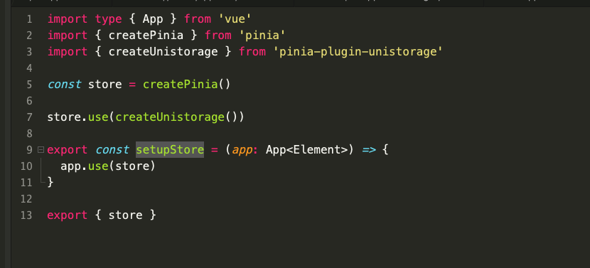
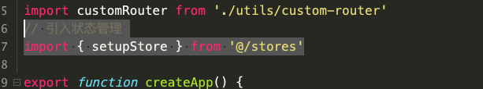
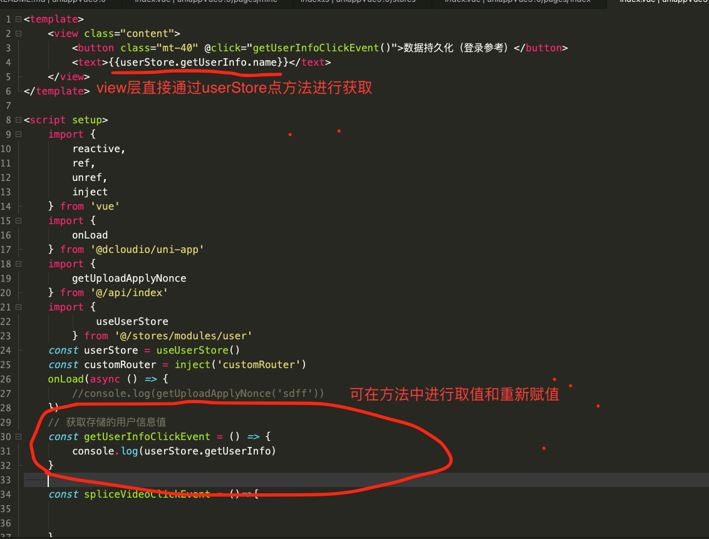

uniapp + vue3 + ts + pinia 开发的uniapp框架下的vue3版本
uniapp3.0 框架【接口请求、数据持久化、css样式快速方便布局，使用UI组件框架为：[uview-plus](https://uview-plus.jiangruyi.com/components/intro.html)，适配H5、微信小程序、iOS/Android 平台  
## 网路请求框架
## 文件上传
## 数据持久化模版

# 使用的是 pinia 和 pinia-plugin-unistorage 框架
## 注意下面以用户user信息存储为例子进行说明，使用前需要 npm i pinia --save 和  npm i pinia-plugin-unistorage --save 安装包管理
## 主要代码及实现原理如下：
## 
 ###  在main.js 入口类文件中进行绑定
 ###  进行挂载数据如下
 ###  3-+
 ### 
 ###  进行数据存储方法如下：
```javascript
// 样例参考如下
userStore.setUserInfo({
	name:'eee',
	phone:'10086'
}) // 存储个人信息
userStore.setToken('258825811') // 存储token 校验值
userStore.setisLogin(true) // 存储是否登录
// 登录之后 必须要进行这个conf 文件的配置，注意这这个地方
```

 ### 获取数据持久化的如下：
 
